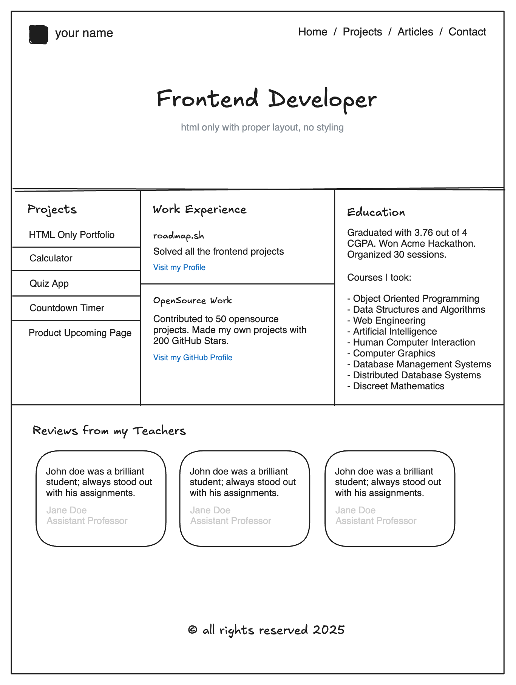

# Basic-HTML-Website

## Description
This is a foundational HTML-only project designed to showcase essential web structure and semantic tags. Ideal for beginners to understand the basics of web development and create a simple, well-structured multiple-page layout.

Goal of this project was to teach myself how to structure a website using HTML i.e different sections of a website like header, footer, navigation, main content, sidebars etc. I was not required to style the website, only required to focus on the structure of the website using HTML. Styling will be done in a separate project. It should look like the following image (remember, you are not required to style the website, only focus on the structure that you can style later):

 

## Key requirements for this project:

In this project, I was required to create a simple HTML only website with multiple pages. The website should have following pages:

- Homepage
- Projects
- Articles
- Contact

The website is to have a navigation bar that should be present on all pages and link to all the pages. Goals of this project are:

- Learn how to create multiple pages in a website.
- Structure a website using HTML in a semantic way.
- Structure in a way that you can easily add styles later.
- Add SEO meta tags to the website.

## Submission Checklist

* Semantically correct HTML structure.
* Multiple pages with a navigation bar.
* SEO meta tags in the head of each page.
* Contact page should have a form with fields like name, email, message etc.

## How to view the project:
1. Clone the repository:
   ```bash
   git clone https://github.com/Ifram3/Basic_HTML_Website.git
   ```
2. Navigate to the project directory and open the `index.html` file in any modern web browser to view the website.

## Technologies Used:

* **HTML5** for strucuturing the page semantically  
* **Meta Tags** and **Open Graph** for SEO and Social Media Optimization.

## Future Technologies

* Add CSS for styling and enhancing the visual appearance of My Portfolio.  
* Use Flexbox for a responsive layout.  
* Add JavaScript for interactivity.

## What I Learnt

* I learnt that using semantic HTML tags such as `<header>`, `<main>`,        `<section>`, and `<footer>` to structure content helps improve accessibility
and SEO.

* How to create a structured navigation menu that links various pages of the site.

## Acknowledgments

Website Template Inspired by [Roadmap.sh](https://roadmap.sh/projects/basic-html-website) And you can still checkout the project [here](https://roadmap.sh/projects/basic-html-website)
